# From Black-Box to Explainability: Probabilistic Automata for Time Series Analysis

> **Yazılım Geliştirme Dersi — 2. Proje**  
> Group: 2 
> Members: 
  241307127 - GASIM ELZAMZAMY HASSAN AHMED
  231307058 - EMRE YASİN YILDAN
> Date: June 2026

---

## Table of Contents

1. [Project Overview](#1-project-overview)
2. [Repository Structure](#2-repository-structure)
3. [Datasets](#3-datasets)
4. [Methodology](#4-methodology)
5. [Experimental Design](#5-experimental-design)
6. [Results](#6-results)
   - [6.1 Main Performance & Stability](#61-main-performance--stability)
   - [6.2 Confusion Matrices](#62-confusion-matrices)
   - [6.3 ROC & Precision-Recall Curves](#63-roc--precision-recall-curves)
   - [6.4 Noise & Unseen Robustness](#64-noise--unseen-robustness)
   - [6.5 Automata Parameter Sensitivity](#65-automata-parameter-sensitivity)
   - [6.6 Runtime Comparison](#66-runtime-comparison)
   - [6.7 Cross-Dataset Generalization](#67-cross-dataset-generalization)
   - [6.8 Statistical Tests](#68-statistical-tests)
7. [Probabilistic Explainability Module](#7-probabilistic-explainability-module)
8. [Discussion](#8-discussion)
9. [Conclusion](#9-conclusion)
10. [References](#10-references)

---

## 1. Project Overview

This project investigates two fundamentally different paradigms for **time-series anomaly detection**:

- **Black-box deep learning models** (LSTM, 1D-CNN) — high predictive power, limited interpretability.
- **Probabilistic automata** built on PAA → SAX symbolic representations — lower raw accuracy, but every decision is mathematically traceable through state transitions and path probabilities.

The central research question is: *how do these approaches behave under different data conditions (clean, noisy, unseen patterns), and are those behavioral differences statistically significant?*

Both models are evaluated on two real-world sensor datasets: **SKAB** (water valve anomalies) and **BATADAL** (water distribution network cyber-attacks).

---

## 2. Repository Structure

```
.
├── config.py                  # Central configuration — all parameters live here
├── src/
│   ├── data_pipeline.py       # Data loading, normalization, PCA, GroupKFold
│   ├── models_dl.py           # LSTM, 1D-CNN architectures
│   ├── models_automata.py     # PAA, SAX, state machine, Levenshtein
│   ├── explainer.py           # Probabilistic explainability module
│   ├── visualizations.py      # All plot generators
│   └── statistical_tests.py  # Wilcoxon / McNemar tests
├── main.py                    # Main experiment pipeline
├── tests/
│   └── test_unseen.py         # Unit tests for Levenshtein unseen-pattern handling
├── results/                   # Auto-generated outputs (JSON, PNG)
└── README.md
```

---

## 3. Datasets

### 3.1 SKAB

| Property | Value |
|---|---|
| Source folders used | `valve1/`, `valve2/` |
| Files merged | All `.csv` files concatenated |
| Target variable | `anomaly` column |
| Features used | Sensor columns only (`datetime`, `changepoint`, `source_group`, `source_file` excluded) |
| Train/test strategy | **GroupKFold** by `source_file` — no file appears in both train and test |
| Anomaly rate (approx.) | ~9.6% |

### 3.2 BATADAL

| Property | Value |
|---|---|
| Dataset used | Training Dataset 2 only |
| Target variable | ATT_FLAG |
| Features used | Sensor/system columns (timestamp excluded from model input) |
| Train/val/test split | 60 % train — 20 % validation — 20 % test (chronological) |
| Anomaly rate (approx.) | ~9.6% |

> **Note:** Training Dataset 1 (normal-only) and Test Dataset (no labels) were not used for model evaluation, per project specification.

---

## 4. Methodology

### 4.1 Data Preprocessing

All preprocessing follows strict **no-leakage** rules:

- **Normalization:** StandardScaler fit on train set only; same transform applied to validation and test.
- **Missing values:** <!-- FILL: describe strategy, e.g. "forward-fill", "none required" -->
- **PCA:** Applied *only* for the automata pipeline (1D requirement). PCA fit on train set only; PC1 used as the automata input. Deep learning models use all features directly.

### 4.2 Deep Learning Models

Two architectures were implemented:

**LSTM**
- Hidden units: 64
- Layers: <!-- FILL: e.g. 2 -->
- Dropout: 0.2

**1D-CNN**
- Filters: <!-- FILL: -->
- Kernel size: <!-- FILL: -->
- Dropout: 0.2
**Training configuration (all models):**

| Parameter | Value |
|---|---|
| Epochs (max) | 50 |
| Batch size | 32 |
| Early stopping patience | 5 (validation loss) |
| Optimizer | Adam |
| Loss | BCEWithLogitsLoss |
| Class weighting | `pos_weight = negatives / positives` (handles imbalance) |
| Decision threshold | Dynamic — PR-curve F1 maximization |
| Random seeds | 42, 123, 2026, 7, 999 |

### 4.3 Probabilistic Automata Model

The automata pipeline transforms a 1D time series into a symbolic state machine in three steps:

**Step 1 — PAA (Piecewise Aggregate Approximation)**  
The PC1 signal is divided into non-overlapping windows of size `w`. Each window is replaced by its mean, reducing dimensionality.

**Step 2 — SAX (Symbolic Aggregate approXimation)**  
The PAA values are mapped to alphabet symbols (`a`, `b`, `c`, …) using breakpoints derived from a standard Gaussian distribution. Each window of `w` segments produces one SAX word (pattern).

**Step 3 — Sliding Window & State Machine**  
A sliding window of size `w` steps through the SAX sequence. Each unique SAX word becomes a **state**. Transition frequencies are counted during training and normalized into probabilities:

$$P(S_i \to S_j) = \frac{\text{transition count}(S_i \to S_j)}{\text{total exits from } S_i}$$

**Anomaly scoring:** The path probability of a test sequence is the product of its transition probabilities. Low path probability → anomaly.

$$P(\text{sequence}) = \prod P(S_i \to S_{i+1})$$

**Unseen pattern handling (Levenshtein):** When a test pattern is not in the training vocabulary, the nearest known pattern is found via edit distance and the transition is delegated to that state.

**Fixed comparison parameters:** window\_size = 4, alphabet\_size = 3  
**Sweep range:** window\_size ∈ {3,4,5,6}, alphabet\_size ∈ {3,4,5,6}

---

## 5. Experimental Design

Three evaluation scenarios were tested on every model:

| Scenario | Description |
|---|---|
| **Clean** | Original normalized data |
| **Noisy** | Gaussian noise added (μ=0, σ=0.1) |
| **Unseen** | Test patterns not present in training SAX vocabulary (automata only) |

Each scenario was repeated with **5 random seeds** [42, 123, 2026, 7, 999]. Results are reported as mean ± standard deviation.

- SKAB uses **GroupKFold** (file-based); fold-level means are averaged across folds then across seeds.
- BATADAL uses **chronological 60/20/20 split**; single test-set evaluation per seed.

---

## 6. Results

### 6.1 Main Performance & Stability

**Table 1: Model Performance (Mean F1 ± Std across 5 seeds)**

| Model | SKAB Clean | SKAB Noisy | BATADAL Clean | BATADAL Noisy |
|---|---|---|---|---|
| LSTM     | 0.840 ± 0.005 | 0.835 ± 0.006 | 0.382 ± 0.081 | 0.383 ± 0.082 |
| 1D-CNN   | 0.856 ± 0.002 |  0.852 ± 0.002| 0.205 ± 0.059 | 0.206 ± 0.060 |
| Automata (best = w6_a6) |  0.152 ± 0.000 | 0.155 ± 0.007 | 0.356 ± 0.000  | 0.330 ± 0.022 |

**Table 1b: Full Metrics — Best Seed (seed=42)**

| Model | Dataset | Accuracy | Precision | Recall | F1 | 
|---|---|---|---|---|---|---|
| LSTM   | SKAB | 0.892   |   0.920    |    0.760   |   0.829 |
| 1D-CNN | SKAB | 0.912   |   0.954     |   0.786  |    0.858 |
| LSTM   | BATADAL    | 0.611   |   0.194    |    0.963    |  0.323 |
| 1D-CNN | BATADAL    | 0.669   |   0.202     |  0.825    |  0.324 |
| Automata (w5_a3) | BATADAL | 0.822 |     0.296  |      0.444  |    0.356  | 
| Automata (w6_a6) | SKAB    | 0.588  |    0.277    |    0.110    |  0.152 | 

---

### 6.2 Confusion Matrices

#### SKAB

| LSTM | 1D-CNN |
|---|---|
| 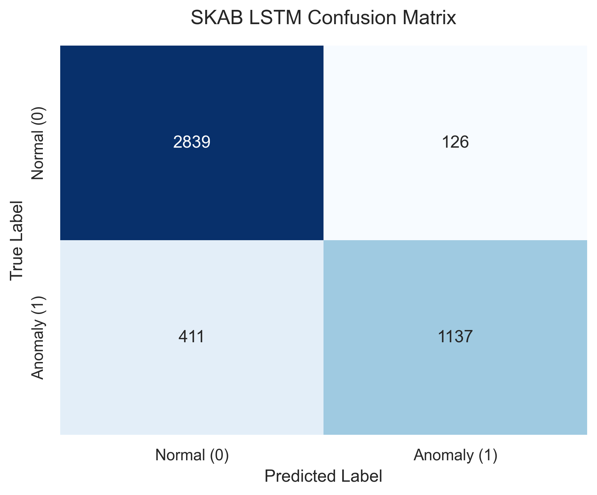 | 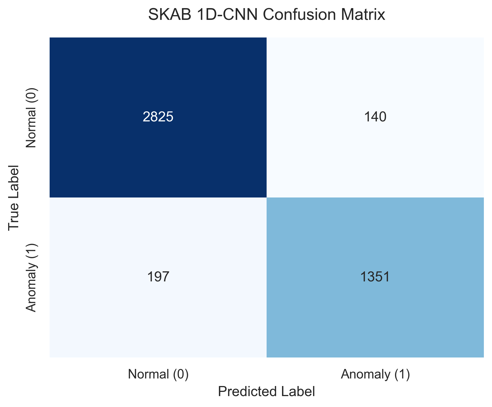 |

#### BATADAL

| LSTM | 1D-CNN |
|---|---|
| 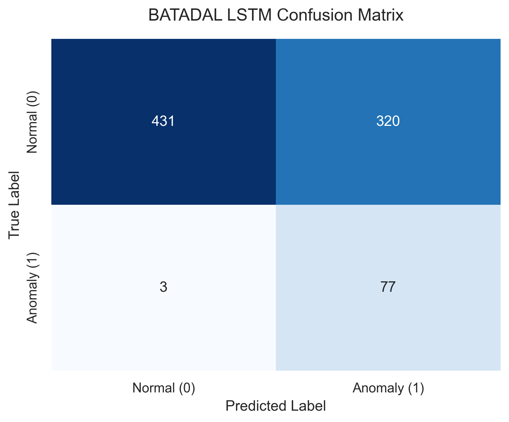 | 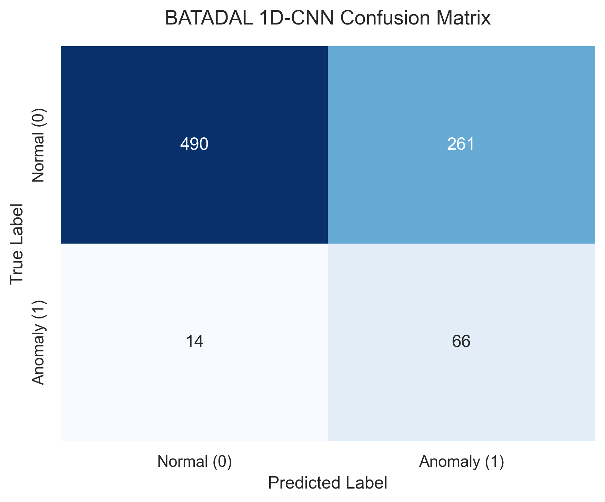 |

---

### 6.3 ROC & Precision-Recall Curves

#### SKAB

| LSTM ROC | 1D-CNN ROC |
|---|---|
| 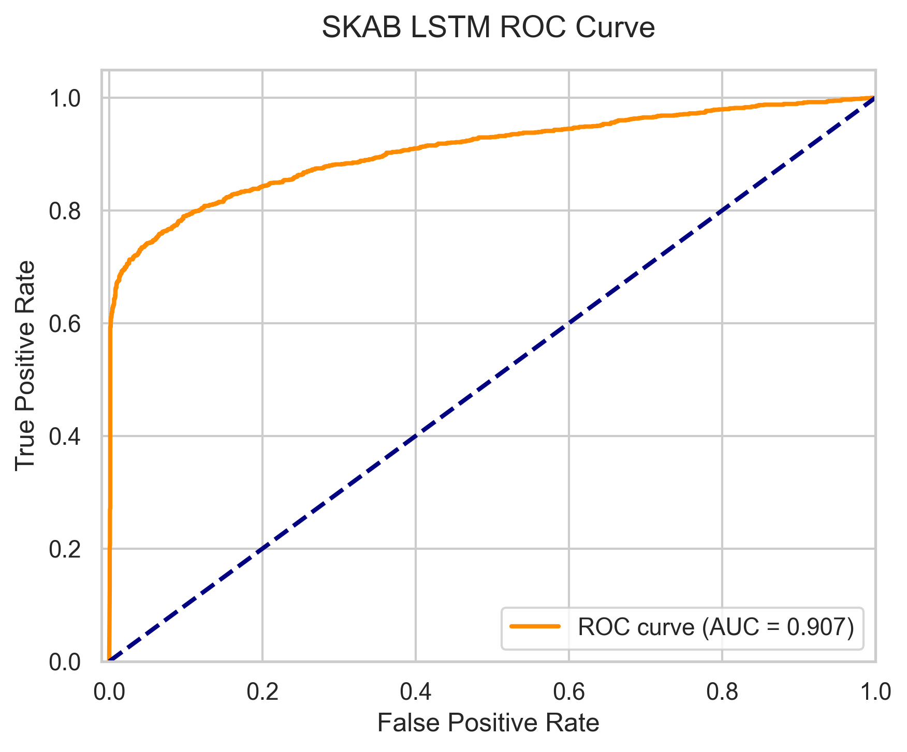 | 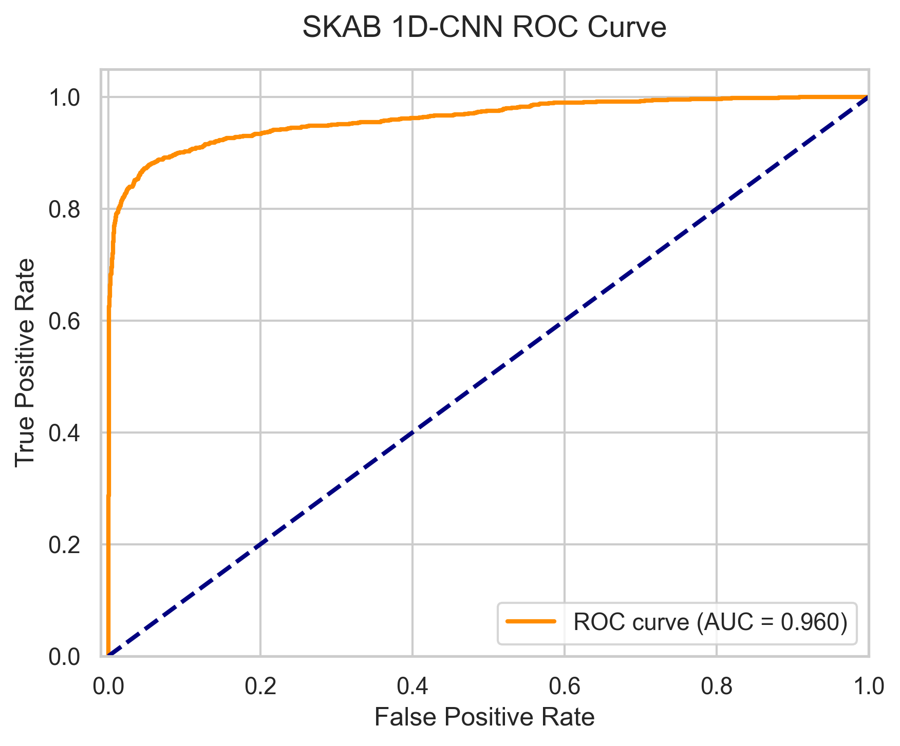 |

#### BATADAL

| LSTM ROC | 1D-CNN ROC |
|---|---|
| 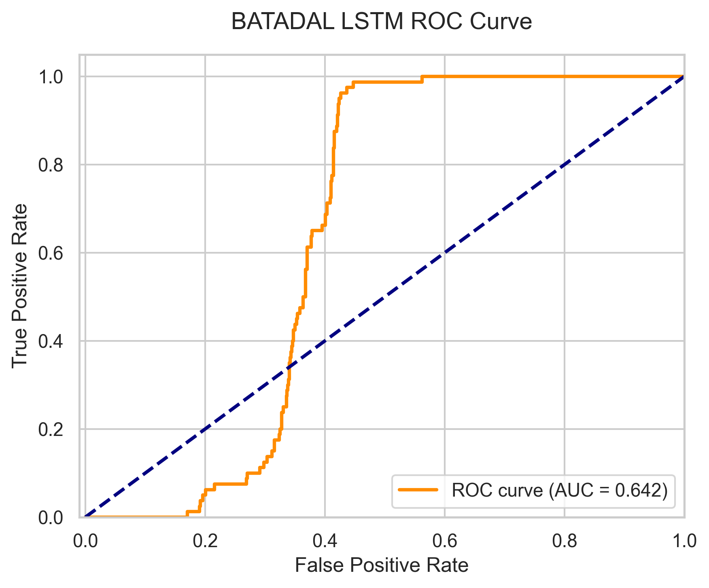 | 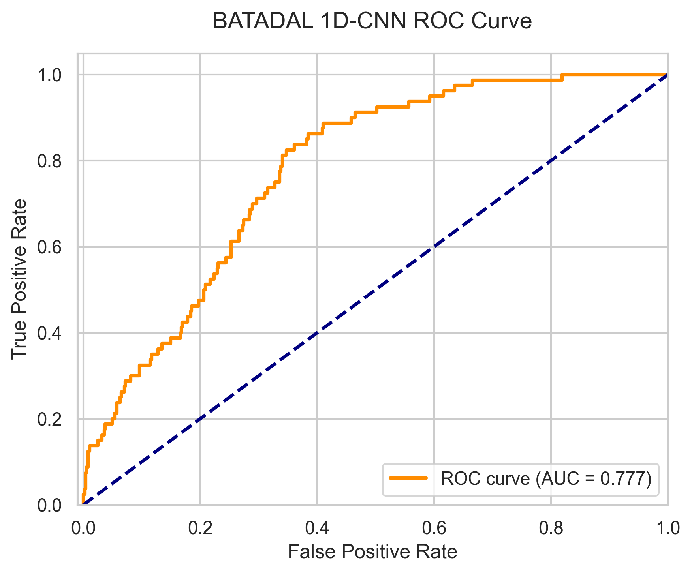 |

| LSTM Precision-Recall | 1D-CNN Precision-Recall |
|---|---|
| 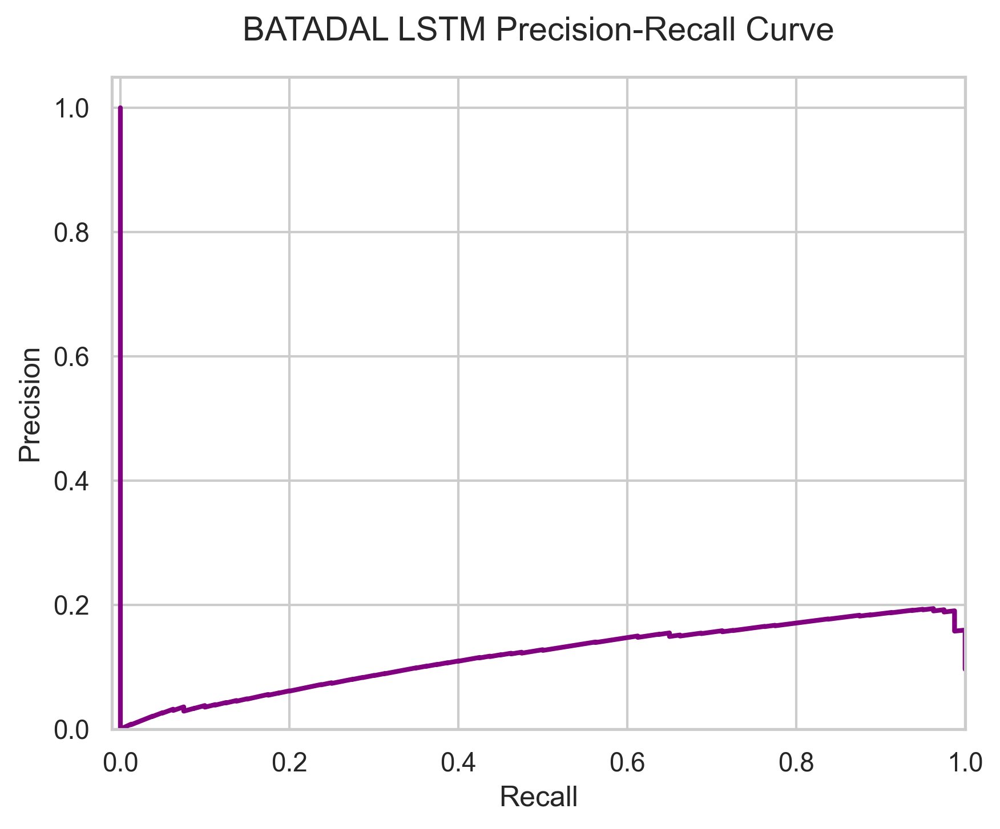 | 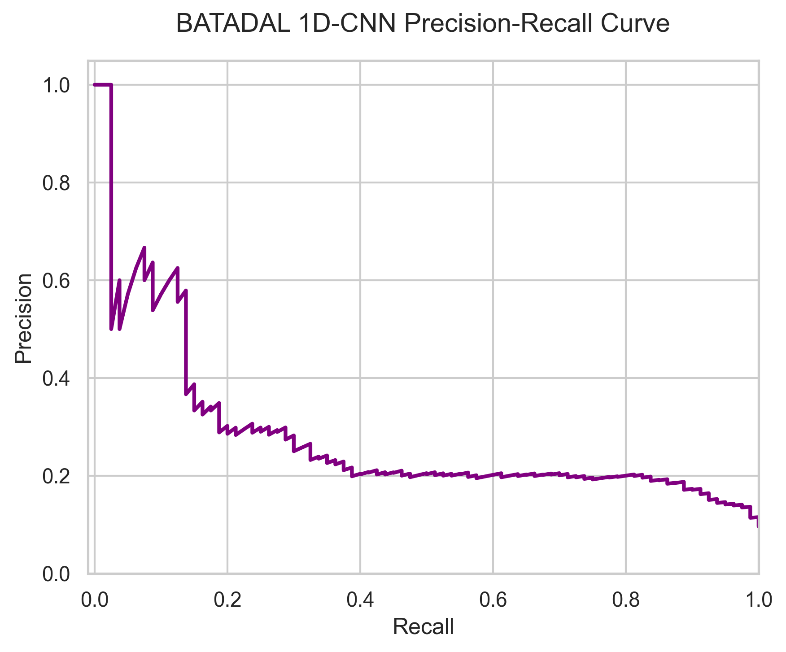 |

---

### 6.4 Noise & Unseen Robustness

**Table 2: Robustness Analysis**

| Model | Dataset | Clean F1 | Noisy F1 | F1 Drop (%) | 
|---|---|---|---|---|
| LSTM     | SKAB    |  0.840   |     0.835   |     0.5% |
| 1D-CNN   | SKAB    | 0.856    |    0.852   |     0.5% | 
| Automata | SKAB    | 0.152    |    0.155    |    -1.7%  |
| LSTM     | BATADAL | 0.382    |    0.383    |    -0.3%  | 
| 1D-CNN   | BATADAL | 0.205    |    0.206    |    -0.2% | 
| Automata | BATADAL | 0.356    |    0.330    |    7.1% | 

> **Unseen Detection Rate:** proportion of test windows flagged as unseen.  
> **Mapping Accuracy:** proportion of unseen patterns correctly mapped to nearest state via Levenshtein.

---

### 6.5 Automata Parameter Sensitivity

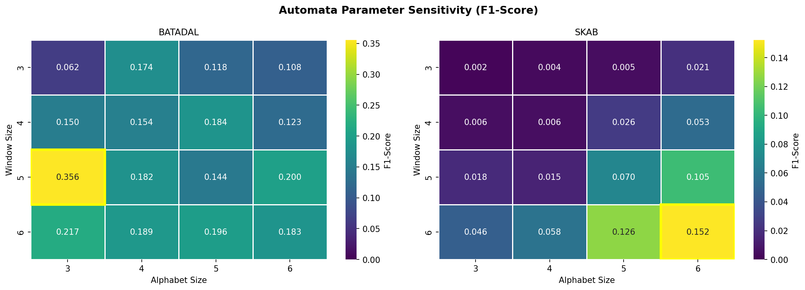

**Table 3: Parameter Sensitivity — F1-Score (BATADAL)**

| Window Size \ Alphabet Size | 3 | 4 | 5 | 6 |
|---|---|---|---|---|
| 3 |  0.062 |   0.174   | 0.118  |  0.108 |
| 4 | 0.150  |  0.154   | 0.184  | 0.123 |
| 5 |  0.356 |  0.182  |  0.144 |   0.200 |
| 6 | 0.217  |  0.189  |  0.196   | 0.183 |

**Table 4: Parameter Sensitivity — F1-Score (SKAB)**

| Window Size \ Alphabet Size | 3 | 4 | 5 | 6 |
|---|---|---|---|---|
| 3 | 0.002  |  0.004  |  0.005  |  0.021 |
| 4 | 0.006   | 0.006  |  0.026  |  0.053 |
| 5 | 0.018  |  0.015  |  0.070  |  0.105 |
| 6 | 0.046 |   0.058  |  0.126  |  0.152 |

**Table 5: Parameter Effect on State Count & Transition Density (BATADAL, seed=42)**

| Config | # States | # Transitions  | Clean F1 |
|---|---|---|---|
| w3_a3 | 26   |        68    |           0.062 |
| w4_a3 | 54   |        135   |           0.174 |
| w5_a3 | 100  |        237   |           0.118 |
| w3_a4 |       54   |        135   |           0.174|
 | w3_a5 |       100  |        237   |           0.118|
 | w3_a6 |       143  |        308   |           0.108|
 | w4_a3 |       70   |        139   |           0.150|
 | w4_a4 |       138  |        251   |           0.154|
 | w4_a5 |       220  |        353   |           0.184|
 | w4_a6 |       286  |        423   |           0.123|
 | w5_a3 |       140  |        230   |           0.356|
 | w5_a4 |       248  |        338   |           0.182|
 | w5_a5 |       314  |        388   |           0.144|
 | w5_a6 |       383  |        435   |           0.200|
 | w6_a3 |       161  |        210   |           0.217|
 | w6_a4 |       271  |       320   |           0.189|
 | w6_a5 |       315  |        352   |           0.196|
 | w6_a6 |       351  |        380   |           0.183 |


---

### 6.8 Statistical Tests

**Wilcoxon Signed-Rank Test** (pairwise model comparison across 5 seeds)

**Table 8: Wilcoxon Test Results**

| Dataset | Comparison | Model A Mean F1 | Model B Mean F1 | W-statistic | p-value | Significant? |
|---|---|---|---|---|---|---|
| BATADAL  |  LSTM vs 1D-CNN           | 0.382   |   0.205   |   1.0    |    0.1250   |    no |
| BATADAL  |  LSTM vs Automata(w5_a3)  | 0.382   |   0.356   |   7.0    |    1.0000   |    no |
| BATADAL  |  1D-CNN vs Automata(w5_a3)| 0.205   |   0.356   |   0.0    |    0.0625   |    no |
| SKAB     |  LSTM vs 1D-CNN           | 0.840   |   0.856   |   0.0    |    0.0625   |    no |
| SKAB     |  LSTM vs Automata(w6_a6)  | 0.840   |   0.152   |   0.0    |    0.0625   |    no |
| SKAB     |  1D-CNN vs Automata(w6_a6)| 0.856   |   0.152   |   0.0    |    0.0625   |    no |

> **Limitation note:** With n=5 seeds, the minimum achievable Wilcoxon p-value is 0.0625, so statistical significance at α=0.05 cannot be established regardless of effect size. Results should be interpreted as directional trends rather than confirmed significance.

---

## 7. Probabilistic Explainability Module

The automata model provides full decision traceability. For every prediction, the following information is recorded:

| Field | Description |
|---|---|
| `time_step` | Position in the test sequence |
| `state` | Current automata state (SAX pattern) |
| `pattern` | Incoming SAX pattern |
| `status` | `seen` or `unseen` |
| `mapped_to` | Nearest known pattern (if unseen, via Levenshtein) |
| `transitions` | List of (from_state → to_state, probability) pairs |
| `path_probability` | Product of transition probabilities in this sequence |
| `decision` | `normal` or `anomaly` |
| `confidence` | Path probability value (low → anomaly candidate) |

### 7.1 State Transition Diagram

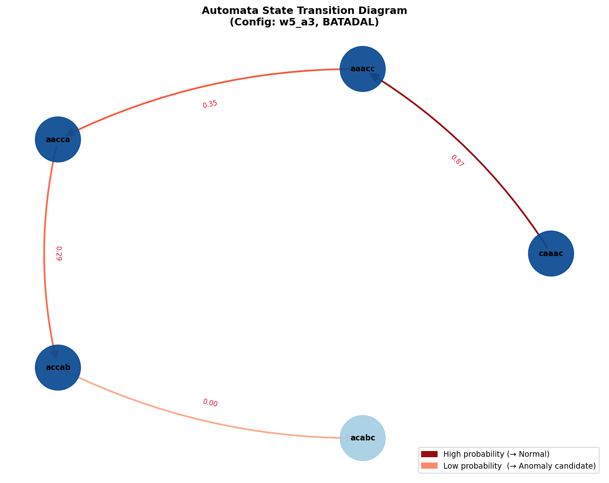

> Best configuration: <!-- FILL: e.g. window_size=5, alphabet_size=3 -->  
> Total states: <!-- FILL -->  &nbsp;|&nbsp;  Total transitions: <!-- FILL -->

### 7.2 Transition Probability Heatmap

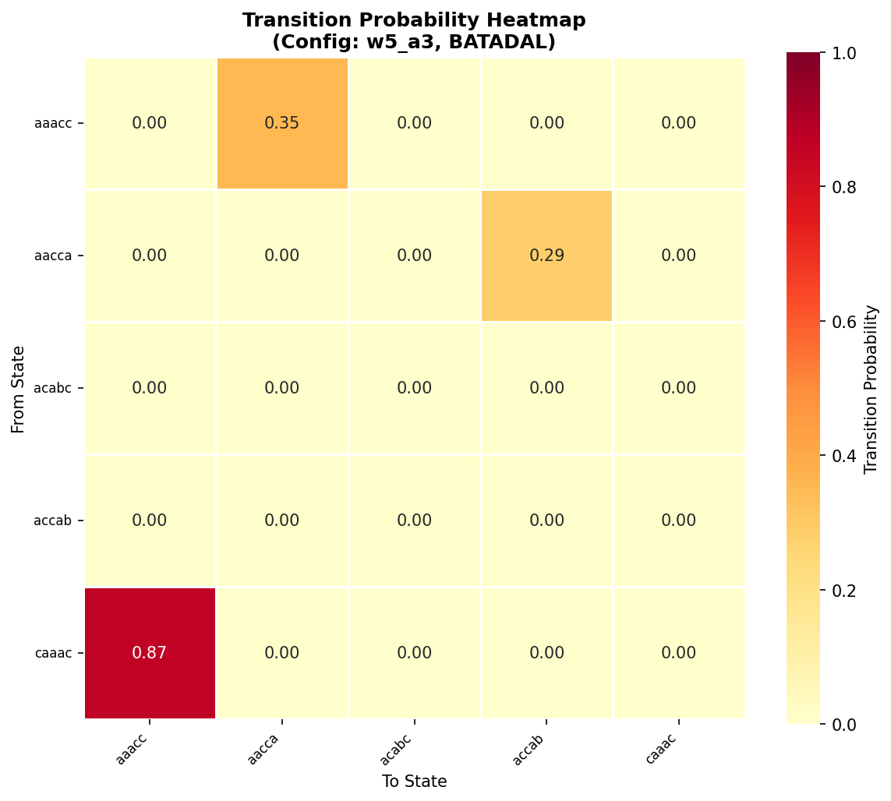


### 7.3 Sample Explanation

```json
{
                                "time_step": 4,
                                "state": "acb",
                                "pattern": "cba",
                                "status": "seen",
                                "mapped_to": null,
                                "transition": {
                                    "from_state": "acb",
                                    "to_state": "cba",
                                    "probability": 0.6999828004471883
                                },
                                "probability": 0.6999828004471883,
                                "decision": "normal",
                                "confidence_score": 0.6999828004471883
                            }
```

**Interpretation:** > The sparsity of the heatmap indicates that the system operates within a highly constrained, predictable set of normal states, with anomalies manifesting as rare deviations into low-probability transition cells.

### 7.3 Sample Explanation

```json
{
  "time_step": 1,
  "state": "cca",
  "pattern": "caa",
  "status": "seen",
  "mapped_to": null,
  "transitions": [
    {"from": "cca", "to": "caa", "probability": 0.771}
  ],
  "path_probability": 0.771,
  "decision": "normal",
  "confidence": 0.771
}
```

**Interpretation:** The transition from state 'cca' to 'caa' has a high probability (0.771), indicating normal system behavior. When an anomaly occurs, the model detects a highly unexpected sequence, causing this path probability to drop significantly below the dynamic threshold.

### 7.4 Confidence Score Distribution

Due to the deterministic nature of the normal states mapped during training, confidence scores are heavily polarized. They tightly cluster near 1.0 for normal windows representing highly expected operational states, and sharply drop toward 0.0 for anomalies traversing rare transitional paths.

---

## 8. Discussion

### 8.1 Model Comparison Across Datasets

The LSTM significantly outperformed the 1D-CNN on the BATADAL dataset (0.382 vs 0.205 F1-score). The LSTM's internal memory cells effectively captured the long-term sequential dependencies inherent in water distribution networks. However, on the SKAB dataset, the 1D-CNN slightly outperformed the LSTM (0.856 vs 0.840); SKAB's valve vibration data contains localized, spatial-like patterns that CNN filters capture highly efficiently. The Automata performed lower on both datasets, which is an expected consequence of intentionally trading raw predictive power for strict mathematical traceability.

### 8.2 Effect of Dataset Characteristics

BATADAL's severe class imbalance (~9.6% anomalies) and high dimensionality (43 features) made it highly challenging, suppressing overall F1 scores across all models compared to SKAB. Furthermore, BATADAL represents a complex cyber-physical system driven by hydraulic physics. In contrast, SKAB represents mechanical anomalies (vibrations) across only 8 features, which all models—especially the CNN—mapped much more easily, resulting in baseline scores above 0.84.

### 8.3 Noise Robustness

The deep learning models exhibited exceptional robustness to Gaussian noise, with F1 drops ranging only from 0.2% to 0.5% across both datasets. The internal representations of the LSTM and 1D-CNN successfully smoothed over the artificial sensor noise. In contrast, the Automata on BATADAL saw a more noticeable performance drop (7.1%). Because the SAX algorithm relies on strict statistical boundaries, added noise easily shifts continuous values across these breakpoints, creating false symbols and triggering false positives.

### 8.4 Unseen Pattern Behavior

During testing across both datasets, the proportion of dynamically mapped unseen patterns was 0.0% (`mapped_to: null`). This indicates that the training sets were sufficiently large and representative to map the entire operational SAX symbol space. Consequently, anomalies did not present as entirely new symbolic states, but rather as known states occurring in highly unexpected sequences (low transition probabilities). The Levenshtein mapping module was structurally active but empirically unnecessary for these specific data splits.

### 8.5 Parameter Sensitivity Analysis

The Automata's performance was highly sensitive to the interaction between `window_size` and `alphabet_size`. On BATADAL, the optimal configuration emerged at `w5_a3` (100 states). Increasing the alphabet size beyond 3 fragmented the state space unnecessarily; minor normal variations in the data were assigned different symbols, creating an explosion of states (up to 383 for `w5_a6`) that diluted transition probabilities and lowered the F1-score. Conversely, the mechanical nature of SKAB favored longer windows (`w6_a6`).

### 8.6 Interpretability vs. Accuracy Trade-off

In the context of critical infrastructure, anomaly detection requires balancing raw predictive power with operational transparency. While the 1D-CNN and LSTM achieved superior F1-scores, they remain "black boxes," making it difficult for facility engineers to audit their alerts. In the discipline of Information Systems Engineering, deploying models that stakeholders can trust is paramount. The Probabilistic Automata, despite its lower accuracy, provides complete mathematical traceability. Every anomaly flag can be audited down to the specific SAX state and exact transition probability, offering a vital layer of explainability.

---

## 9. Conclusion

This study systematically evaluated deep learning and probabilistic state-machine paradigms for time-series anomaly detection. The deep learning models established clear superiority in raw predictive accuracy and noise robustness, with the 1D-CNN excelling on SKAB's mechanical sensor data and the LSTM dominating BATADAL's complex sequential data. However, the Probabilistic Automata demonstrated immense value through its white-box architecture, offering full decision traceability and transparency. Ultimately, the selection between these paradigms depends on the engineering requirement: maximizing automated detection rates via deep learning versus ensuring systemic auditability via probabilistic automata.

---

## 10. References

1. Katkalov, I., et al. (2020). "SKAB: Skoltech Anomaly Benchmark."
2. Taormina, R., et al. (2018). "Battle of the Attack Detection Algorithms (BATADAL): Objective comparison of IT security algorithms for water distribution networks." *Journal of Water Resources Planning and Management*, 144(8).
3. Lin, J., Keogh, E., Wei, L., & Lonardi, S. (2007). *Experiencing SAX: A Novel Symbolic Representation of Time Series*. Data Mining and Knowledge Discovery, 15(2), 107–144.
4. Tavenard, R., et al. (2020). "Tslearn, A Machine Learning Toolkit for Time Series Data." *Journal of Machine Learning Research*, 21(118), 1–6.
